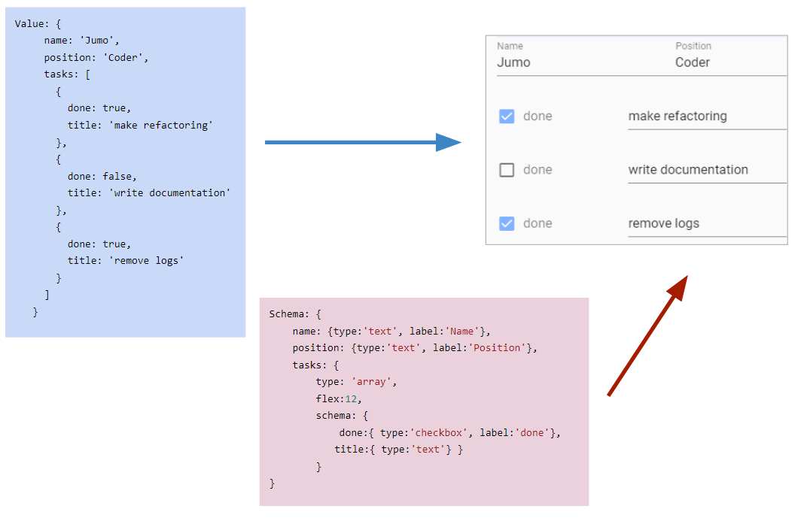
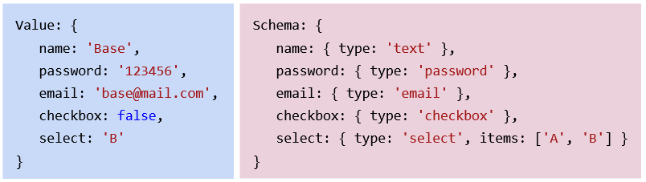
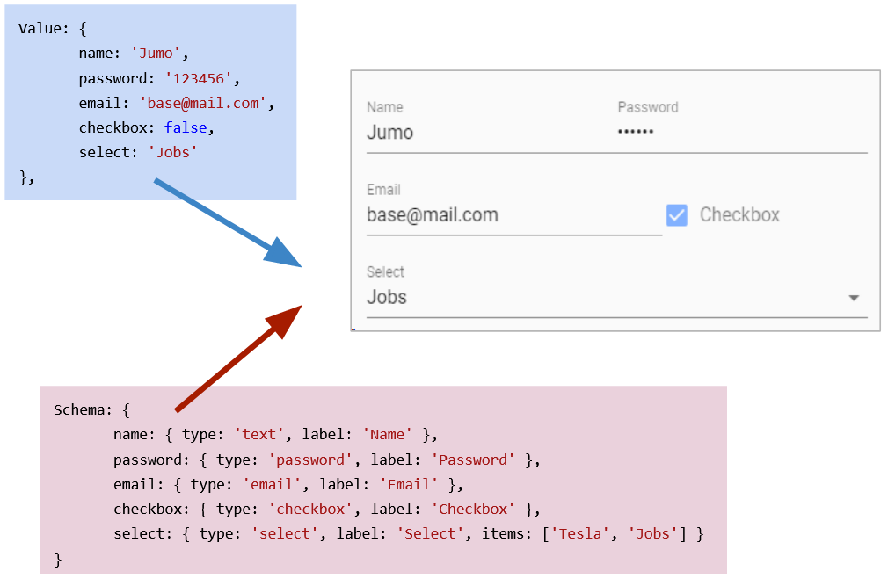
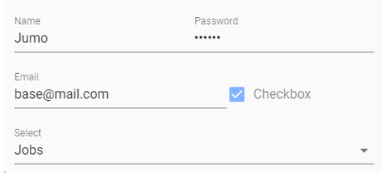
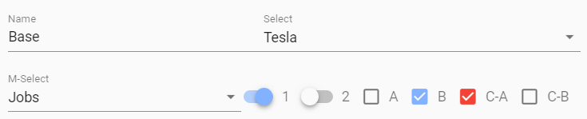
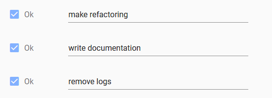
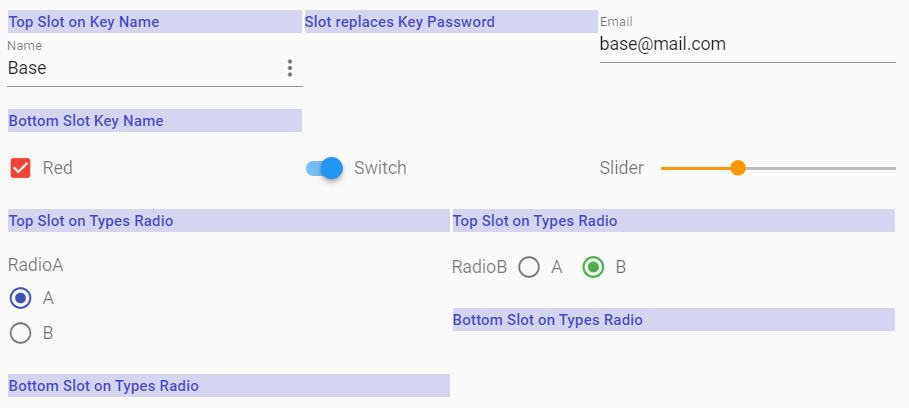
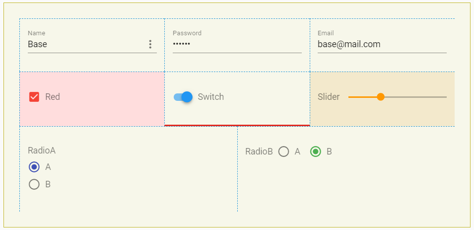

# Vuetify-Form-Base

Imagine you get Data as JS-Object and you have to create an editable Form.

```javascript
Model: {
	name: 'Stoner',
	position: 'Admin',
	tasks: [
		{ 
		  done: true,
		  title: 'make refactoring' 
		},
		{ 
		  done: false,
		  title: 'write documentation'  
		},
		{ 
		  done: true,
		  title: 'remove logs'  
		}        
	]        
}
```

Normally you have to flatten the Data-Structure and map all to an appropriate Format. Then you have to define a HTML-Form and animate it with your Data. 

With **Vuetify-Form-Base** create a Schema Object with the same Structure as your Data.

```javascript
Schema: {
	name: { type:'text', label:'Name' },
	position: { type:'text', label:'Position' },
	tasks: { 
		type: 'array',
		schema: { 
			done:{ type:'checkbox', label:'done', col:3}, 
			title:{ type:'text', col:9 }
		} 
	}
}  
```

and you will get a working Form. 




If you have to generate Forms or you have to edit Data presented as JSON- or JS-Objects, then take a closer look at **Vuetify-Form-Base** and try it. It can make your work much easier and save your time. This Form Generator works as [Vue.js 2.0 Component](https://vuejs.org/) and can simplify your Work by automatically creating Forms, based on your Schema-Definition. 

Furthermore if you don't define a Schema, then **Vuetify-Form-Base** tries to generate a schema automatically. This works if the Data Values are of Type 'string', 'number' or 'bool'.

**Vuetify-Form-Base** uses the well known and excellent [Component Framework Vuetify 2.0](https://vuetifyjs.com/) to style and layout your Form. Vuetify Controls have a clear, minimalistic design and support responsive Design. If necessary add specific layouts by using the implemented Vuetify [Grid System](https://vuetifyjs.com/en/components/grids/).

---
## Demo

[Here you can see a Demo with Key-Examples](https://wotamann.github.io/)

or

Clone or download this Project, change current directory to **./vuetify-form-base/example**  and then run

`npm install`

`npm run serve`

or 

Download and open this [HTML-File](https://github.com/wotamann/vuetify-form-base/blob/master/dist/index-cdn.html) in your Browser

or 

Play with [Fiddle](https://jsfiddle.net/wotamann/204z6vpq/13/)

or 

Copy this HTML File with CDN
```HTML
<html>
	<head>
	  <link href="https://fonts.googleapis.com/css?family=Roboto:100,300,400,500,700,900" rel="stylesheet">
	  <link href="https://cdn.jsdelivr.net/npm/@mdi/font@5.x/css/materialdesignicons.min.css" rel="stylesheet">
	  <link href="https://cdn.jsdelivr.net/npm/vuetify@2.x/dist/vuetify.min.css" rel="stylesheet">
	  <meta name="viewport" content="width=device-width, initial-scale=1, maximum-scale=1, user-scalable=no, minimal-ui">
	</head>	
	<body>
		<div id="app">
		<v-app>
		  <v-main>
			<v-container>
				<v-form-base :col="{cols:12, sm:6, md:3 }" :model="model" :schema="schema" @input="log" />
			</v-container>
		  </v-main>
		</v-app>
		</div>

		<script src="https://cdn.jsdelivr.net/npm/vue@2.x/dist/vue.js"></script>
		<script src="https://cdn.jsdelivr.net/npm/vuetify@2.x/dist/vuetify.js"></script>
		<script src="https://unpkg.com/vuetify-form-base"></script>
		<script>
		new Vue({
			el: '#app',
			vuetify: new Vuetify(),
			components: { vFormBase },
			data () {
				return {      
				  model: {
					text: 'Base',
					password: 'abcdefgh',
					checkbox:true,
					file: [] // array of File objects
				  },     
				  schema: {
					text: 'text', // shorthand for ->  text: { type:'text', label:'text' }                   
					password: { 
					  type: 'password',
					  clearable: true,
					  solo:true,
					  class:'mx-2 mt-2'
					},			  
					checkbox:'checkbox',
					file: { 
					  type: 'file', 
					  label: 'Images', 
					  showSize:true,
					  counter:true
					}
				  }
				}
			},
			methods:{
				log(v){ 
					console.log(v) 
				}
			}
		})
		</script>
	</body>
</html>
```


---
## Intro

**vuetify-form-base** comes as a singular File. It is a [Vue Component](https://vuejs.org/v2/guide/components.html) and can easily integrated into any Vue Project.   

```HTML
<v-form-base :model="myModel" :schema="mySchema" @input="handleInput" />

<!-- ident but deprecated  -->
<v-form-base :value="myModel" :schema="mySchema" @input="handleInput" />
````

The Schema-Object has the **same Structure** as the Model-Object. Create a Schema by copying the Model-Object and replace the Values of the Model-Object by Definitions for your your Schema. This corresponding Schema-Object defines type, layout and functional behaviour of the Controls in your Form. 



---

The [Component Framework Vuetify 2.0](https://vuetifyjs.com/) styles your Form. The Controls have a clear design, but don't worry if you need more you can change Style and Layout. For more Details see Section **Style with CSS**

### Autogenerated Schema
If you don't define a Schema, then **Vuetify-Form-Base** tries to generate a schema automatically. But this works only if the Model Values are of Type 'string','number' or 'bool'.

### Defined Schema
Based on an existing Model **vuetify-form-base** generates a full editable Form using defined Schema. Layout and Functionality are defined in a Schema-Object, which has the same Property structure as the Model-Object. Your Data-Object keeps full reactive and any Input or Change in your Form triggers an Event too. 

If you have a deep nested Model-Object including any Array-Structure you can direct work on it. There is no need to flatten or modify your Data Presentation. 



Changing any Field in the Form gives you a **reactive Result** in your Model-Object. 
Furthermore you can **synchronize** two or more Forms by using same Model-Object. 

If you want a **Partial-Form** which displays only parts of your Data.Object, then link a property of your Data-Object to your **vuetify-form-base** Component. 

And if necessary you can also build a **Form in Form** by using **Slots**.

---
## Events in 'v-form-base' 

Use the v-on directive to listen to Events for 

>**'Focus', 'Input',  'Click', 'Blur', 'Resize', 'Intersect', 'Mouse'** and **'Swipe'**. 

>**'Change'** will catch 'Input' and 'Click'. 

>**'Watch'** will listen to 'Focus', 'Input', 'Blur' and 'Click'. 

>**'Update'** will catch all Events. 

```HTML
<!-- No ID defined -->
<v-form-base 
  :model="myModel"
  :schema="mySchema"
  @input="handleInput"
  @resize="handleResize"
/>

<!-- ID defined  -->
<v-form-base 
  id="form-base-person"
  :model="myModel"
  :schema="mySchema"
  @input:form-base-person="handleInput"
  @blur:form-base-person="handleblur"
/>
````
---
## Supported Attributes in 'v-form-base'
```HTML

<v-form-base 
  id="my-form-base"
  :model="myModel"
  :schema="mySchema"
  :row ="rowAttributesForLayoutControl"
  :col = "globalColDefinition"  
  @input:my-form-base="handleInputOrOtherEvents"
/>
<!-- deprecated -->
<v-form-base 
  :value= "myModel"
  :flex = "globalColDefinition"  
/>
````
---
## Supported Controls - Vuetify Input & Controls  
---

### Text-Field

````javascript
  // Textfield - Text: 
  schema: { ctrl: 'text' }  // shorthand definition
  
  schema: { 
    ctrl: { type:'text', ...} 
  }
  // Textfield - Password: 
  schema: { ctrl: 'password' }
  
  schema: { 
    ctrl: { type:'password', ...} 
  }
  // Textfield - Email:  
  schema: { ctrl: 'email' }
  
  schema: { 
    ctrl: { type:'email', ...} 
  }
  // Textfield - Number:  
  schema: { ctrl: 'number' }
	
  schema: { 
    ctrl: { type:'number', ...} 
  }

  // Use most of Attributes from <v-text-field>
  schema: { 
    ctrl: { 
      type:'text', 
      label:'Search', 
      hint:'Books', 
      prependIcon:'search', 
      clearable:true } 
    }
````

  [More Informations to Vuetify-Textfield Attributes find here](https://vuetifyjs.com/en/components/text-fields/). 

---
### Access native Type of HTML-INPUT
Prop 'ext' in combination with Type:'text' make the native [HTML Input Type ]( https://www.w3schools.com/tags/att_input_type.asp ) accessable. 

````javascript
mySchema:{    
  range:{ 
    type:'text', 
    ext:'range' 
  },
  color:{ 
    type:'text', 
    ext:'color',
    prependIcon: 'palette', 
    label:'Color'
  },    
  date:{ 
    type:'text', 
    ext:'date', 
    locale:'en',
    prependIcon: 'event', 
    label:'Date'
  },
  time:{ 
    type:'text', 
    ext:'time', 
    format:'24h',
    prependIcon: 'timer', 
    label:'Time'
  }
}
````
---

### File-Input: 
````javascript
schema: { ctrl: 'file', ... }
schema: { ctrl: { type:'file', ...}, ... }
````
[More Informations to Vuetify File-Input find here](https://vuetifyjs.com/en/components/file-inputs/). 

---

### Textarea:
````javascript
schema: { ctrl: 'textarea', ... }
schema: { ctrl: { type:'textarea', ...}, ... }
````
[More Informations to Vuetify Textarea find here](https://vuetifyjs.com/en/components/textarea/). 

---

### Checkbox, Radio or Switch:
````javascript 
// Checkbox
schema: { ctrl: 'checkbox', ... }
schema: { ctrl: { type:'checkbox', ...}, ... }

// Radio: 
schema: { ctrl: { type:'radio', ...}, ... }

// Switch: 
schema: { ctrl: 'switch', ... }
schema: { ctrl: { type:'switch', ...}, ... }
````
[More Informations to Vuetify Selection-Controls find here](https://vuetifyjs.com/en/components/selection-controls/). 

---
### Slider
````javascript
// Slider: 
schema: { ctrl: 'slider', ... }
schema: { ctrl: { type:'slider', ...}, ... }
````
[More Informations to Vuetify Sliders find here](https://vuetifyjs.com/en/components/sliders/). 

---
### Icon
````javascript
// Icon: 
schema: { ctrl: 'icon', ... }
schema: { ctrl: { type:'icon', ...}, ... }
````
[More Informations to Vuetify Icons find here](https://vuetifyjs.com/en/components/icons/). 

---
### Image
````javascript
// Image: 
schema: { ctrl: 'icon', ... }
schema: { ctrl: { type:'img', src:'...', ...}, ... }
````
[More Informations to Vuetify Icons find here](https://vuetifyjs.com/en/components/icons/)

--- 
### Button
````javascript
// Button: 
schema: { ctrl: 'btn', ... }
schema: { ctrl: { type:'btn', ...}, ... }
````
[More Informations to Vuetify Buttons find here](https://vuetifyjs.com/en/components/buttons/). 
### Button-Group 
````javascript
// Button Group: 
schema: { ctrl: 'btn-toggle', ... }
schema: { ctrl: { type:'btn-toggle', ...}, ... }
````
[More Informations to Vuetify Button Groups find here](https://vuetifyjs.com/en/components/button-groups/). 

---
### Select, Combobox, Autocomplete

Select Data from Array defined in Schema

````javascript
// Select:
schema: { ctrl: 'select', ... }
schema: { ctrl: { type:'select', items:['1','2'] }, ... }
````
[More Informations to Vuetify Select find here](https://vuetifyjs.com/en/components/select/). 
````javascript
// Combobox:
schema: { ctrl: 'combobox', ... }
schema: { ctrl: { type:'combobox', items:['1','2']}, ... }
````
[More Informations to Vuetify Combobox find here](https://vuetifyjs.com/en/components/combobox/). 
````javascript
// Autocomplete:
schema: { ctrl: 'autocomplete', ... }
schema: { ctrl: { type:'autocomplete', items:['1','2']}, ... }
````
[More Informations to Vuetify Autocomplete find here](https://vuetifyjs.com/en/components/autocomplete/). 

---
### List and Treeview

Select Items from an Array in your Model
````javascript
// List: Edit  
schema: { ctrl: 'list', ... }
schema: { ctrl: { type:'list', ...}, ... }
````
[More Informations to Vuetify List-Item-Groups find here](https://vuetifyjs.com/en/components/list-item-groups/). 
````javascript
// Treeview: 
schema: { ctrl: 'treeview', ... }
schema: { ctrl: { type:'treeview', ...}, ... }
````
[More Informations to Vuetify Treeview find here](https://vuetifyjs.com/en/components/treeview/). 

---
### Model-Array

````javascript
  // Array: 
  model:{
    ctrlArray:[
      { idx:1, ctrl:'A'},
      { idx:2, ctrl:'B'},
      { idx:3, ctrl:'C'}
    ]
  }
	schema: { 
    ctrlArray: { 
      type:'array',
      // optional define key for array removing 
      key:'idx' // or ['idx','ctrl']
      // define schema of your items in array
      schema: { ctrl: 'text' }
    }, 
	}
````
---
### Group Controls
````javascript
  // Grouping
  model:{
    group1:{ a: 'A', b: 'B', c: 'C' }
    group2:{ a: 'A', b: 'B', c: 'C' }
  }
	schema: { 
    group1: { 
      type:'group',
      schema: { a:'text', b:'text', c:'text' }
    }, 
    group2: { 
      type:'group',
      schema: { a:'text', b:'text', c:'text' }
    }, 
	}
````

[See more under Example 'Group Controls'](https://wotamann.github.io/) 

---
### Color - Pickers, Menu & Native Implementation
````javascript
// Color Picker: 
schema: { ctrl: 'color', ... }
schema: { ctrl: { type:'color', ...}, ... }

// Textfield with linked Color Menu
color:{ 
  type:'color', 
  ext:'text',
  prependIcon:'palette', 
  label:'Color'
}    
// Color - Native HTML <Input type="color" /> 
color:{ 
  type:'text', 
  ext:'color',
  prependIcon:'palette', 
  label:'Color'
}    
````
[More Informations to Vuetify Color-Pickers find here](https://vuetifyjs.com/en/components/color-pickers/). 

### Date|Month - Pickers, Menu & Native Implementation

````javascript
// Date Picker: 
schema: { ctrl: 'date', ... }
schema: { ctrl: { type:'date', ...}, ... }

// Textfield with linked Date Menu
date:{ 
  type:'date', 
  ext:'text',
  locale:'en',
  prependIcon:'event', 
  label:'Date'
}

// Textfield with linked Month Menu
date:{ 
  type:'date', 
  ext:'text',
  typeInt:'month', 
  locale:'en',
  prependIcon:'event', 
  label:'Date'
}

// Date - Native HTML <Input type="date" />
date:{ 
  type:'text', 
  ext:'date', 
  locale:'en',
  prependIcon: 'event', 
  label:'Date'
}
````	
[More Informations to Vuetify Date-Pickers find here](https://vuetifyjs.com/en/components/date-pickers/). 

### Time - Pickers, Menu & Native Implementation

````javascript
// Time Picker: 
schema: { ctrl: 'time', ... }
schema: { ctrl: { type:'time', ...}, ... }

// Textfield with linked Time Menu
time:{ 
  type:'time', 
  ext:'text', 
  format:'24h',
  prependIcon: 'timer', 
  label:'Time',    
  menu:{ closeOnContentClick:false, nudgeRight:200, maxWidth:'290px', minWidth:'290px' }
}

// Time  - Native HTML <Input type="time" />
time:{ 
  type:'text', 
  ext:'time', 
  format:'24h',
  prependIcon: 'timer', 
  label:'Time'
}
````
[More Informations to Vuetify Time-Pickers find here](https://vuetifyjs.com/en/components/time-pickers/). 
	
[See Example under Section 'Date, Time, Color as native HTML-Type, Menu and Pickers'](https://wotamann.github.io/) 

---
## Installation

For proper working you need a Vue.js Project with Vuetify 2.0 installed. Get started with **Vuetify**, the world’s most popular Vue.js framework for building feature rich, blazing fast application [here](https://vuetifyjs.com/en/getting-started/quick-start/).

>**INFORMATION:** Vue-Loader doesn't autoload components, because Vuetify-Form-Base use 
```html
<component is="my-component" />
```
and therefore Components must be [manually imported](https://vuetifyjs.com/en/customization/a-la-carte/). More information about dynamic components is in the official [Vue documentation](https://vuejs.org/v2/guide/components.html#Dynamic-Components)


After successful installation of a Vue 2.6 Project with Vuetify 2.0  

    npm install vuetify-form-base --save

**vuetify-form-base** is a [Vue.js single-file component](https://vuejs.org/v2/guide/single-file-components.html) with a .vue extension and you can use it like any Vue-Component. 

In order for your application to work properly, you must wrap it in a [v-app](https://next.vuetifyjs.com/en-US/framework/default-markup) component. This component is required and can exist anywhere inside the body, but must be the parent of ALL Vuetify components. **v-main** needs to be a direct descendant of **v-app**. 

>Information: since Vuetify 2.3.10 **"v-content"** is named **"v-main"** 

### How to manually import components and directives

#### Steps to import
1. Go to the file ```src/plugins/vuetify.js```
2. Import the necessary components and directives used by vuetify-form-base:
  - Components
    - VRow
    - VCol
    - VTooltip
  - Directives
    - Ripple
    - Intersect
    - Touch
    - Resize
3. After this, the library will be successfully imported to your Vue file, and no errors on the console should appear.
4. If a new error appears on the console, it means component you are using is not imported. See the name of the component on the console and add tot he plugin file.

#### Example file from ```src/plugins/vuetify.js```

```js
import Vue from 'vue';
import Vuetify, {
    VRow,
    VCol,
    VTextField,
    VTooltip,
    VCheckbox,
    VSelect,
} from 'vuetify/lib';
import { Ripple, Intersect, Touch, Resize } from 'vuetify/lib/directives';

Vue.use(Vuetify, {
    components: { VRow, VTooltip, VCol, VTextField, VCheckbox, VSelect },
    directives: { Ripple, Intersect, Touch, Resize },
});

export default new Vuetify({});
```
This example shows how to import the needed components and directives to use the vuetify-form-base and some basic components like VTextField, VCheckbox, VSelect.

### Quickstart with VUE-File
```HTML
<!-- exampleFile.vue -->
<template>
  <v-app>
  <!-- Since Vuetify 2.3.10 "v-content" is named "v-main"  -->
    <v-main>
      <v-container fluid>
        <v-form>
          <v-form-base :model="myModel" :schema="mySchema" @input="handleInput"/>
        </v-form>
      </v-container>   
    </v-main>
  </v-app>
</template>

```
```javascript
import VFormBase from 'vuetify-form-base';  

export default {	
  components:{ VFormBase },
  data () {
    return {
      myModel: {
        name: 'Jumo',
        password: '123456',
        email: 'base@mail.com',
        checkbox: true,
        select: 'Jobs',
      },   
      mySchema: {
        name: { type: 'text', label: 'Name' },
        password: { type: 'password', label: 'Password' },
        email: { type: 'email', label: 'Email' },
        checkbox: { type: 'checkbox', label: 'Checkbox' },
        select: { type: 'select', label: 'Select', items: ['Tesla', 'Jobs', 'Taleb'] }
      }
    }
  },
  methods:{
    handleInput(val){
      console.log(val) 
    }
  }
}
```
and you will get a full editable Form based on your schema and filled with your Model-Object. 



>INFORMATION: 
>
>Properties in 'myModel' without corresponding Prop in 'mySchema', are ignored and keep untouched, but a initial warning will be logged to console

---
## Example displaying nested Data-Object
 

In Reality sometimes you will have deep nested objects or arrays, which should be edited. **vuetify-form-base** works for you and flatten internally this nested object and build a plain Form.   

```javascript
myValue: {
  name: 'Base',
  controls:{
    selection:{
      select: 'Tesla',
      selectM: ['Jobs'],
    },
    switch: [ true,false ],
    checkbox: [ false, true, { 
      checkboxArray: [ true, false ]}
    ]
  }       
},

mySchema: {
  name: { type: 'text', label: 'Name'},
  controls:{
    selection:{
      select: { type: 'select', label: 'Select', items: ['Tesla', 'Jobs', 'Taleb'] },        
      selectM: { type: 'select', label: 'M-Select', multiple:true, items: ['Tesla', 'Jobs', 'Taleb']}
    },
    switch: [ 
      { type: 'switch', label: '1' }, 
      { type: 'switch', label: '2' } 
    ],
    checkbox: [
      { type: 'checkbox', label: 'A' },
      { type: 'checkbox', label: 'B' }, 
      { checkboxArray: [
        { type: 'checkbox', label: 'C-A', color:'red' },
        { type: 'checkbox', label: 'C-B', color:'red' }
      ]}  
    ],
  }
}
```




---
## Example editing Data-Arrays
 
For editing arrays use the type 'array' and define an nested 'schema' property. 

```javascript
    mySchema: {
      tasks: {
        type: 'array',
        schema: { 
          done: { type: 'checkbox'  }, 
          title: { type: 'text' }
        }
      }  
    }
```

#### Type Array - Schema object

```javascript
    myValue: {      
      tasks: [
        {
          idx:0,
          done: true,
          title: 'make refactoring'
        },
        {
          idx:1,
          done: true,
          title: 'write documentation'
        },
        {
          idx:2,
          done: true,
          title: 'remove logs'
        }
      ]
    },
    mySchema: {
      tasks: {
        type: 'array',
        // 'key' is optional.
        // For working on arrays (ie removing) define a key
        // IMPORTANT: don't use an editable key (because of permanent re-iteration on change) 
        key:'idx',
        schema: { 
          done: { type: 'checkbox', label: 'Ok', col: 3 }, 
          title: { type: 'text', col: 8 },            
        }
      }
    }
```



---
## Dynamic Schema
 
IF you want Schema Properties to be changed **dynamic**, then you must make a **computed** Schema Object. 

This Example turns the Radio Layout from Column to Row on Resizing to Layout-Size medium or greater. 

```javascript
data () {
  return {
    myModel:{
      radio: 'A',
    }, 
  }
},
//  dynamic Schema with computed 
computed:{
  mySchema() { 
    return {       
      radio: { type: 'radio', row: this.row, options:['A','B'] }
    }  
  },
  row () { return this.$vuetify.breakpoint.mdAndUp }
}
```
---

## Vuetify Display, Typography and Spacing

Integrate Vuetify-Display and Layout behaviour by using the Schema-Property 'class':

```javascript
    mySchema: {
      name: { type: 'text', class:'title d-flex d-sm-none ml-4 pa-1 float-left' },
    }
```
[More Info at Vuetify Display:](https://vuetifyjs.com/en/styles/display) 

[More Info at Vuetify Typography:](https://vuetifyjs.com/en/styles/typography) 

[More Info at Vuetify Spacing:](https://vuetifyjs.com/en/styles/spacing) 

[More Info at Vuetify Float:](https://vuetifyjs.com/en/styles/float) 


[See Example under Section 'Display, Typographie and Layout'](https://wotamann.github.io/) 

---

## Vuetify Grid

Integrate Vuetify-Grid behaviour by setting the Form-Base Property 'col':

**Default Form-Base Definition**

```html
<!-- object declaration -->
<form-base :col="{ cols:12, sm:8, md:6, lg:4 }" ... />
<!-- ident but deprecated -->
<form-base :flex="{ xs:12, sm:8, md:6, lg:4 }" ... />  

<!-- default grid -->
<form-base :col="{ cols:12 }" ... />
<form-base :col="{ cols:'auto' }" ... />

<!-- or shorthand for {cols:12 }  -->
<form-base :col=12 ... />
<form-base :col="12" ... />
<!-- ident but deprecated -->
<form-base :flex="12" ... />

<!-- NEW 'row' Attribute 
set v-row and is a wrapper component for v-col. It utilizes flex properties 
to control the layout and flow of its inner columns. Standard gutter can be
reduced with the dense prop or removed completely with no-gutters

see -> https://vuetifyjs.com/en/components/grids/ 
-->
<form-base :row="rowAttribute" :col="12" ... />
```
```javascript
const rowAttribute = { justify:'center', align:'center', noGutters:true } 
```
  
**Schema-Definition (overrules Form-Base Definition)**

Get individual Grid-Control by using Schema-Properties 'col', 'offset' and 'order'.

```javascript
mySchema: {      
  name1: { type: 'text', col: 4, offset: 2, order: 1 },
    // col: 4     // shorthand for col: { cols:4 }
    // offset: 2  // shorthand for offset: { offset:2 }
    // order: 1   // shorthand for order: { order:1 }
  },
  name2: { 
    type: 'text', 
    col: { cols:12, sm:6, md:4, lg:3, xl:2 }, 
    offset:{ offset:0, sm:1, md:2 }, 
    order:{ order:0, sm:1, md:2 } 
  }
}
```
  
[More Info at Vuetify Grid:](https://vuetifyjs.com/en/framework/grid#usage) 
 

---

## Link & Synchronize

Forms can be **linked** together using the same Model-Object. Changes in one Form are synchronized and reflected in the other Form. 

```HTML
	<v-form-base :model="myValue" :schema="mySchema" />
  
	<v-form-base id="form-sync" :model="myValue" :schema="mySchema" />
```
---

## From 'cebab-case' to 'camelCase' in Vuetify-Controls API

[Use Vuetify Controls API:](https://vuetifyjs.com/en/components/text-fields#api) Props in Vuetify-Controls in **kebab-case** must be converted to **camelCase** in Schema-Definition.
 
```javascript
  mySchema: { 
    name: { type:'text', prependIcon:'menu', backgroundColor:'red' }  
  }
```
maps to 
```HTML
	<v-text-field prepend-icon="menu" background-color="red"></v-text-field>
``` 
---

## Schema

```HTML
<v-form-base :model="myValue" :schema="mySchema" />

<v-form-base 
  id="form-id" 
  :model="myValue" 
  :schema="mySchema" 
  :col="12" 
  :change:form-id="myEventHandler"
/>
```
	
Schema is an Object, which defines and controls the behavior of your Form. Each Key in your Schema-Object should reflect a Key from your Data-Object. 

```javascript
data () {
  return {
    myValue:{
      name: 'Base'  
    }, 
    mySchema:{
      name: 'text' // shorthand for name: { type:'text', label:'name' }  
    }
  }
}
```

The next example shows a more complex Schema:
  
```javascript  
    // Partials Functions for Rules
    const minLen = l => v => (v && v.length >= l) || `min. ${l} Characters`
    const maxLen = l => v => (v && v.length <= l) || `max. ${l} Characters`
    const required = msg => v => !!v || msg
    const validEmail: msg => v => /.+@.+\..+/.test(v) || msg
  
	  // Destruct value from obj and return a modified value! 
    const toUpper = ( {value} ) => typeof value === 'string' ? value.toUpperCase() : value 

    export default {
    
      components: { VFormBase },

      data () {
        return {
          // model
          myModel: {
            name: 'Base',
            password: '123456',
            email: 'base@mail.com'
          },
          // schema
          mySchema: {
            name: { 
              type: 'text', 
              label: 'Name', 
              hint:'Converts to UpperCase'
              toCtrl: toUpper, 
              fromCtrl:toUpper,
              rules: [ required('Name is required<>) ] 
              col: 12, 
            },
            password: { 
              type: 'password', 
              label: 'Password', 
              hint:'Between 6-12 Chars', 
              appendIcon: 'visibility', 
              counter: 12, 
              rules: [ minLen(6), maxLen(12) ], 
              clearable: true, 
              col: 12 
            },
            email: { 
              type: 'email', 
              label: 'Email', 
              rules: [ validEmail('No valid Email'), required('Email is required<>) ], 
              col: 12 
            }
          }
        }
      }

    }
```

**Available Properties in Schema **
  
[For more Schema-Properties see Vuetify Controls API](https://vuetifyjs.com/en/components/text-fields#api)  

	schema:{
      
      type: string            // text, password, email, file, textarea 
                              // radio, switch, checkbox, slider,
                              // select, combobox, autocomplete, 
                              // array, list, treeview
                              // icon, btn, btn-toggle 
                              // date, time, color
  
  	  ext: string             // access to native HTML-Input Type 

      sort: num               // use simple order to display items 

      col:   num or object    // See Vuetify Grid
      flex:  num or object    // DEPRECATED 
      order: num or object    // use Vuetify-Grid  
      offset: num or object   // See Vuetify Grid

      label string,           // label of item    
      placeholder: string,    // placeholder 
      hint: string,           // additional Info  
      tooltip: string | bool | object // show tooltip - use Slots for individual text

      color: string
      backgroundColor:string
      class: string,            // inject classnames - schema:{ name:{ css:'small'}, ...  }
        
      mask: string,           // regex to control input  

      multiple: bool,         // used by type: select, combobox, autocomplete    
      required: bool,         // need an input value
      hidden: bool,           // hide item - set from another item
      disabled: bool,         
      readonly: bool,          
            
      appendIcon: icon        // click triggers event with icon-location
      prependIcon: icon       // click triggers event with icon-location

      items: array            // ['A','B'] used by type: select, combobox, autocomplete   
      options: array,         // ['A','B'] used by type:radio
      rules: array of Fn      // [ value => true || false, ... ]
      
      // must return a (modified) value!!
      toCtrl: function,       // ( {value, obj, data, schema} ) => value	
      fromCtrl: function,     // ( {value, obj, data, schema} ) => value
    }

---
## Events

We can use the v-on directive to listen to vuetify-form-base events **'focus', 'input', 'click', 'blur', 'change', 'watch', 'mouse', 'display', 'intersect', 'resize', 'swipe', 'update'** and run some Code when they’re triggered.

This Example use the Default ID and listen all events with 'update':

```HTML
    <!-- HTML -->
    <v-form-base :value= "myValue" :schema= "mySchema" @update= "update" />
```

The next Code has the Custom ID **'form-base-simple'**. In this case your v-on Directive must append the Custom ID like **@update:form-base-simple:**

```HTML
    <!-- HTML -->
    <v-form-base 
      id = "form-base-simple" 
      :value= "myValue" 
      :schema= "mySchema" 
      @update:form-base-simple= "update" 
    />
```

You can listen to one or more Events

```HTML
  <!-- HTML -->
  <!-- compose Listener to one or more of following Events: -->
  <v-form-base 
    :model= "myValue" 
    :schema= "mySchema" 
    
    @click= "log"
    @input= "log"
    @change="log"    // input|click
    @watch= "log"    // focus|input|click|blur
    @focus= "log"
    @blur=  "log"        
    @mouse= "log"    // mouseenter|mouseleave  
    @display= "log"  // resize|swipe|intersect 
    @intersect="log" // intersect - https://vuetifyjs.com/en/directives/intersect
    @resize= "log"
    @swipe=  "log"   // touch events        
    @update= "log"   // catch all events    
  />      
```

**The Event-Signature:**

```javascript
    change( {  on, id, key, value, params, obj, data, schema, parent, index, event } ){
      // destructure the signature object 
    }
```

    on -        Trigger Name  // focus|input|blur|click|resize|swipe|update 
    id -        Formbase-ID
    key -       key of triggering Element
    value -     value of triggering Element
    obj -       triggering Element { key, value, schema } 
    event -     the native trigger-event if available 
    params -    params object if available { text, x, y, tag, model, open, index }    
    index -     index of array of schemas  
    data -      Data-Object
    schema -    Schema-Object
    parent -    Formbase-Object - if available 
---
**Example: Use 'Change' Event to change Visibility on Password Element**

```HTML
    <!-- HTML -->
    <v-form-base :model="myValue" :schema="mySchema" @change="change">
```

```javascript
    ...

    mySchema: {
      firstPassword:{ type:'password', appendIcon:'visibility', .... }
    }
    
    ...
    
    change ({ on, key, obj, params }) {
      // test event is 'click' and comes from appendIcon on key 'firstPassword'
      if (on == 'click' && key == 'firstPassword' && (params && params.tag) == 'append') {         
        // toggle icon
        obj.schema.appendIcon = obj.schema.type === 'password'? 'lock': 'visibility'
        // toggle visibility 
        obj.schema.type = obj.schema.type === 'password'? 'text': 'password'
      }
    }
```
---
## Slots

Use Slots to pass Header and Footer into a Control. If necessary replace Controls by Slots. Any slot could be a v-form-base component itself.   
 
```HTML
   <!-- FORM-BASE-COMPONENT -->
    <v-form-base id="form-base-css" :model="myValue" :schema="mySchema" >
      <!-- FORM SLOT -->
      <h4 slot="form-base-css-top" class="slot">
        Top Slot of 'Form'
      </h4>
      <h4 slot="form-base-css-bottom" class="slot">
        Bottom Slot of 'Form'
      </h4>  
      <!-- KEY SLOTS -->
      <h4 slot="slot-top-key-name" class="slot">
        Slot at Top of Key 'Name'
      </h4>
      <h4 slot="slot-item-key-password" class="slot">
        Slot replaces Key 'Password'
      </h4>
      <h4 slot="slot-bottom-key-email" class="slot">
        Slot at Bottom of Key 'Email'
      </h4>
      <!-- TYPE SLOTS -->
      <h4 slot="slot-top-type-btn-toggle" class="slot">
        Slot at Top of Type 'Btn-Toggle'
      </h4>
      <h4 slot="slot-bottom-type-btn" class="slot">
        Slot at Bottom of Type 'Btn'
      </h4>
      <h4 slot="slot-top-type-radio" class="slot">
        Slot at Top of Type 'Radio'
      </h4>
      <!-- TOOLTIP SLOTS -->
      <div
        slot="slot-tooltip"
        slot-scope="slotProps"
      >
        Tooltip-Slot: {{ slotProps.obj.schema.tooltip }} has value '{{ slotProps.obj.value || 'undefined' }}'
      </div>
      <!-- TOOLTIP SLOT -  New Syntax VUE 2.6.0 -->
      <!-- <template v-slot:slot-tooltip="slotProps">
         {{ slotProps.obj.schema.tooltip }} with Value: {{ slotProps.obj.value }}
      </template> -->
    </v-form-base>
```

[Try CSS & Slots in Example](https://wotamann.github.io/)



---
## Form Validation

If you need Form Validation you have to wrap **v-form-base** with **[v-form](https://next.vuetifyjs.com/en/components/forms#api)** and take the reference of v-form for working on.
    
```HTML    
    <!-- HTML -->    
    <v-form ref="form" v-model= "formValid" lazy-validation>
      <v-form-base :model= "myValue" :schema= "mySchema" @update= "update"/>
    </v-form>
```
```javascript
    <!-- JS -->
    validate () {
      this.$refs.form.validate()
    },

    resetValidation () {
      this.$refs.form.resetValidation()
    },
```

[Try **Form with Rules and Validation** in Example](https://wotamann.github.io/)

---

## Style with CSS 


Customize your **vuetify-form-base** component using CSS-Classnames 
 
[Try **CSS, SLots, Tooltips & Buttons** in Example](https://wotamann.github.io/)

>  **IMPORTANT:**  
>  Don't use **`<style scoped>`** in parents component, because scoped definitions
>  are inside the child component not accessable


### Formbase - Default ID

`#form-base` is the default ID of your component. If you need different CSS for two or more forms in the same parent component, then change default value by setting a different ID for each component and use this new ID. Using a 'custom-id' you have to modify the event-binding to @update:custom-id = "update" 

#### - Default ID   	
```HTML
    <!-- HTML-Template -->   
    <v-form-base @update= "update" />  
```
```CSS
    #form-base {...} 
```
#### - Custom-ID
```HTML

    <!-- HTML-Template -->   
    <v-form-base id="custom-id" @update:custom-id= "update" />  
```
```CSS 
    #custom-id {...} 
```

### Type - Classnames

  
  Style all items of a specific type, then use type specific classnames. They start with `type-` appended by any `type`. You can use following types in your Schema-Object: 

```CSS

    #form-base .type-text { color: #44A }}           	  
    #form-base .type-email { font-weight:500; }  

```
### Key - Classnames

  Set Classname of deep key in your Data-Object, by converting **.dot notation** 'person.adress.city' into **kebab case** 'person-adress-city' prepending 'key-' 

```CSS
    <!-- 
	    myValue{ person:{ adress:{ city:'',... } ... } ... } 
      CSS Classname to access to key 'city'
    -->
    #form-base .key-person-adress-city { font-weight:500; }    
    

    <!-- 
      Access to myValue: { name:'' }
      CSS Classname to access key 'name' 	       
    -->
    #form-base .key-name { font-weight:500; }            
    
    <!-- 
      myValue: { controls: { slide: [25, 64]  } 
      Access First Entry in Array of Key Slide 
    -->
    #form-base .key-controls-slide-0 { font-weight:500; }  
```

### Validate with Pseudoselectors
```CSS	  
    #form-base .item input:valid { background-color: #afa; }
    #form-base .type-email input:invalid { background-color: #faa; }
    #form-base .key-name input:focus { background-color: #ffd; }   
```

### CSS - Example
```javascript	  
    <!-- JS -->
    myValue: {
        name: 'Base',
        password: '123456',
        email: 'base@mail.com',
        controls: {
          checkbox: true,
          switch: true,
          slider: 33,
          radioA: 'A',
          radioB: 'B'
        }
      }

```	  
```CSS	  
     <!-- CSS  -->
    <style>
      #form-base { 
        border: 1px solid #cb2; 
        background-color: #ffe; 
        padding:2rem 
      }
      
      /* CSS Item --- set all items  */
      #form-base .item { 
        border-left: 1px dashed #29D; 
        border-top: 1px dashed #29D; 
        padding:1rem 
      }

      /* CSS Type --- set all items with type */
      #form-base .type-switch { border-bottom: 3px solid #E23}
      #form-base .type-checkbox { background-color: #fdd }

      /* CSS Keys --- select key in object 'myValue.controls.slider' */
      #form-base .key-controls-slider { background-color: #fec }
    </style>
```



---
## Features

* Vue-Component
* integrates UI framework Vuetify 2.0 with responsive Layout and Support of Grid
* Use Vuetify Control & Input types inclusive most of available API-Props
* Define and use custom Components
* Get full configurable Forms based on Schema Definition
* Full control over Grid
* Drag and Drop Integration 
* Edit plain or deep nested objects including Arrays, without the need to flatten your data
* Get a full, reactive Result
* Listen on 'Resize', 'Focus', 'Input', 'Blur', 'Click', 'Swipe', 'Intersect', 'Mouse' and 'Update' Events
* Use Slots to pass Header and Footer into a Control or replace a Control by a Slot.  Use  Slots to individualize your Tooltip   
* Configurable CSS Style 

---
## Change

 See change.log

---
## Dependencies

vue >= 2.6   -  current vuetify doesn't support vue 3.0

vuetify >= 2.0

lodash > 4.15

vue-the-mask

---
## Similar Projects


[vue-form-generator](https://github.com/icebob/vue-form-generator)

[vue-formular](https://github.com/matfish2/vue-formular)

---
## License

**vuetify-form-base** is available under the MIT license.
